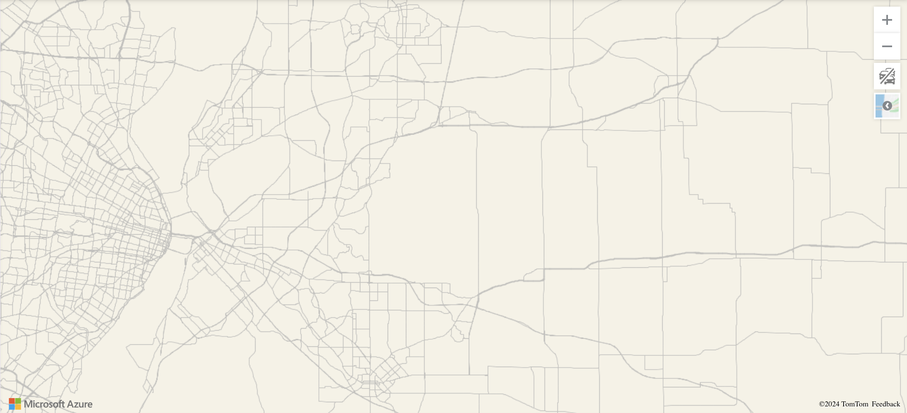

# Azure Maps Issue in Turbopack

## Issue Description

When attempting to load a map through Azure maps when using turbopack, the map fails to load, either altogether (showin in this repo) or when applying tiles (which is occurring in my organization's actual codebase, but isn't sharable).

Failing at tile application: 

This only happens within turbopack, and appears to be an issue with how a recursive function is compiled.

## Steps to Reproduce

1. Set up an account with [Azure Maps](https://azure.microsoft.com/en-us/products/azure-maps/) to get a subscription key
2. Set an environment var named AZURE_SUBSCRIPTION_KEY to the subscription key you received from Azure
3. Run `pnpm dev` and observe the map successfully loads
4. Run `pnpm dev --turbo` and observe the map fail to load

## Identified Issue

I'm not sure if this is the root issue, but there is an initial issue in the turbopack build related to a recursive function in `azure-maps-control`.

The original Azure code is the following:

```js
// azure-map-controls/dist/atlas-esm.js

function leastBadBreaks(lastLineBreak) {
  if (!lastLineBreak) {
    return [];
  }
  return leastBadBreaks(lastLineBreak.priorBreak).concat(lastLineBreak.index);
}
```

As you can see, if the argument is falsey at any point in the recursive call tree, it does not attempt to continue to call `leastBadBreaks`.

This is what turbopack compiles this code to:

```js
return function e(t) {
    return ("TURBOPACK compile-time truthy", 1) ? e(t.priorBreak).concat(t.index) : ("TURBOPACK unreachable", undefined);
```

This no longer actual uses the truthiness of the argument, and instead always tries to get the value of `t.priorBreak`; this is crashing because the value is sometimes null.
